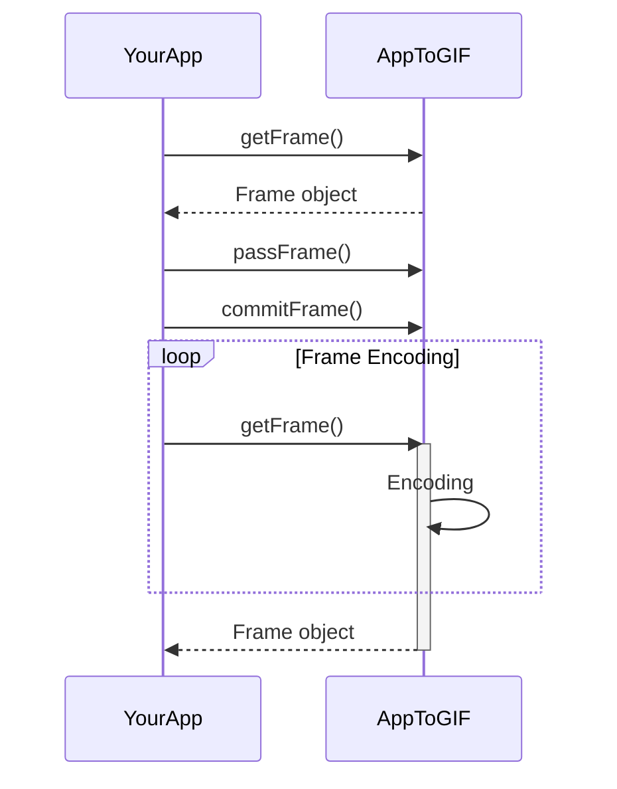
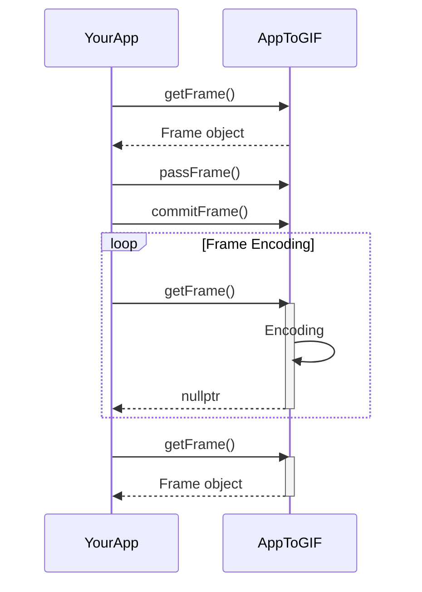

# AppToGIF
C++ multithreaded library used to create GIF in real time from your application.
The main two features of library are:
- Asynchronous mode: Ability to create gif files in 'real time',
- Synchronous mode:  Ability to render gif files with all avaialbe frames
 ## Examples
**Bounction balls**  

OpenGL render code source: [OpenGL Examples](https://cs.lmu.edu/~ray/notes/openglexamples/).
 ### Documentation
 This section goes over creating AppToGIF singeleton instance, initialization and how to use it in your app.
 Along with use cases few demo-app's are beign included in demo folder and shortly presented below.
 1. AppToGIF instance creation
 The library instance can be obtained as singelton object and assigned to EncoderApp reference object as showed below.
```c++
/* -- AppToGIF object --- */
AppToGIF::EncoderApp& app = AppToGIF::EncoderApp::getInstance();
```
2. Initialization
In order to initialize AppToGIF object one need to pass the GIF settings into the initialization function.
```c++
/* --- GIF settings --- */
AppToGIF::GIFSettings set;
/* --- Encoder initialization --- */
app.init(set);
```
Example settings assignment is presented below.
```c++
/* --- GIF settings --- */
AppToGIF::GIFSettings set;
set.fileName = "AppToGIF.gif";
set.inputHeight = 255;
set.inputWidth = 255;
set.outputWidth = 255;
set.outputHeight = 255;
set.frameRate = 50;
set.bitRate = 10000;
set.bgraEncoding = true; //No need to be done - enabled by default
```
At this point the encoder can be started along with mode selection. At this point two modes are supported:
- **Synchronous mode** (Render mode): YourApp need to wait for encoding to happen before continuing working.
Such configuration assures that all frames created by your app are proceded, but result in longer run time.
Operation principle is showed in a diagram below.

- **Asynchronous mode** (RealTime mode): YourApp does not need to wait for frames encoding and if getFrame() method results
in a `nullptr` YourApp flow should continue and encoding will take place in a second thread. Such behaviour results in frame
dropping comparing to YourApp but the run time should be equal original application operation time - see diagram below.

The default behaviour is the **Synchronous mode** and the **Asynchronous mode** can be set as follows
```c++
app.setAsynchronousMode();
```
In order to feed the encoder with frame data one needs to create a Frame pointer that will be later filled with image data
```c++
/* --- Frame used to feed encoder with data --- */
std::shared_ptr<AppToGIF::Frame> appFrame;
// Inside a render loop ...
/* --- Get Frame form encdoer --- */
appFrame = app.getFrame();
```
Inside a render loop if asynchronous mode has been selected check if `appFrame != nullptr`. If not use nested for loops with
getRow() method to fill Frame object. The next step is to reset Frame pointer (The encoder checks if it is the only owner before encoding) 
and then passing and commiting a frame.
>Note: If one has choosen FrameBuffer length greater than 1 few frames can be passed before commiting

Below a basic encoding procedure has been presented that can be inserted inside the render loop of YourApp.
```c++
/* --- Inside a render loop --- */
if(appFrame != nullptr)                             // Check gf frame is not nullptr - only in asynchronous mode
{
    std::cout<<"Frame: "<<++counter<<"\n";
    for (int y = 0; y < appFrame->m_height ; y++)
    {
        uint8_t *row = appFrame->getRow(y);
        for (int x = 0; x < appFrame->m_width; x++)
        {
            const int index = x*4;                  //4 for BGRA encoding
            row[index + 0] = BlueData;
            row[index + 1] = GreenData;
            row[index + 2] = ReadData;
            row[index + 3] = AlphaData;
        }
    }
    /* --- Reset frame pointer to lose ownership --- */
    appFrame.reset();
    /* --- Pass frame to encoder --- */
    app.passFrame();
    /* --- If no more frames need to be pased to the queue - commit frame --- */
    app.commitFrame();
}
```
